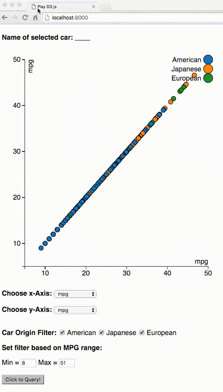
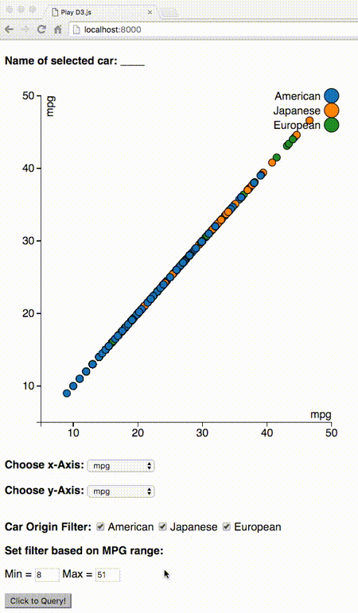
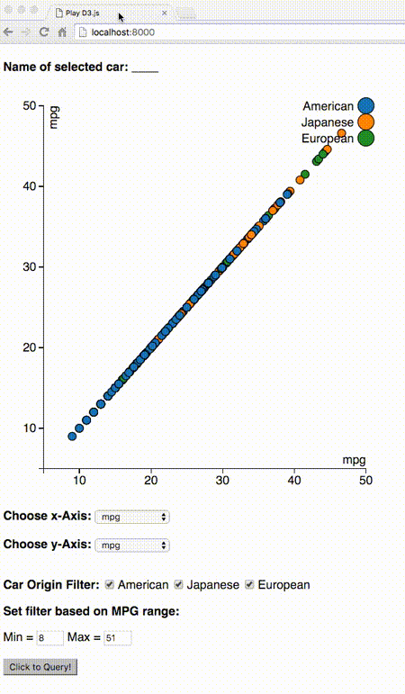

# BigData_Lab_D3js

Solutions to Lab assignment "D3.js" of Big Data course

# Demo of required features

> Your must use JS to read the data from car.csv located on the server. You shall not hard code the data.

See source: [Line 173-183 of js](https://github.com/Puriney/BigData_Lab_D3js/blob/151a5d8bd960d2668f5fc46ff7179b98d59dcd3d/script/scatter.plot.js#L173-L183)

> Complete the dropdown lists in the UI div for selecting the data dimensions to be plotted as x-axis and y-axis. You shall not hard code the dimensions.

See source: [L193-L233 of js](https://github.com/Puriney/BigData_Lab_D3js/blob/151a5d8bd960d2668f5fc46ff7179b98d59dcd3d/script/scatter.plot.js#L193-L233)

It avoids hard-coding the dimension names and instead binds the data and automatically renders dimension names into option list of html.

> After the “Query MPG” button is pressed, the visualization is updated to render only those cars with MPG in the range defined by the mpg-min, mpg-max input box.

Min/Max values on input boxes of html are not hard-coded as well. It smartly binds data to automatically render Min/Max choice. In addition, in order to achieve friendly UI, there are following new features:
  - Printed min value = round(actual min * 0.9); printed max value = round(actual max * 1.1). Thus data points are less likely to leak out of canvas.
  - Up/Down triangle selection button increase/decrease inputed value by given step size, which is smartly computed by = (actual_max - actual_min) / #Points.

> D3 rendering must use the enter/exit/update data mapping.

See source: [L100 of js](https://github.com/Puriney/BigData_Lab_D3js/blob/151a5d8bd960d2668f5fc46ff7179b98d59dcd3d/script/scatter.plot.js#L100) where `.exit()` and `.remove()` are used. It follows enter/exit/update rendering logics. Furthermore, the page is listening to click event which triggers customized `update()` function.

> When the mouse hovers a scatterplot point, the `<h4>` header is updated to show the hovered car name.

Not only car name is displayed as `<h4>` when mouse hovered, but also it is automatically removed when mouse moved-away to avoid ambiguity.

# Demo of additional features

- Filter data points based on `origin` of car
- Figure legend based on `origin` of car

